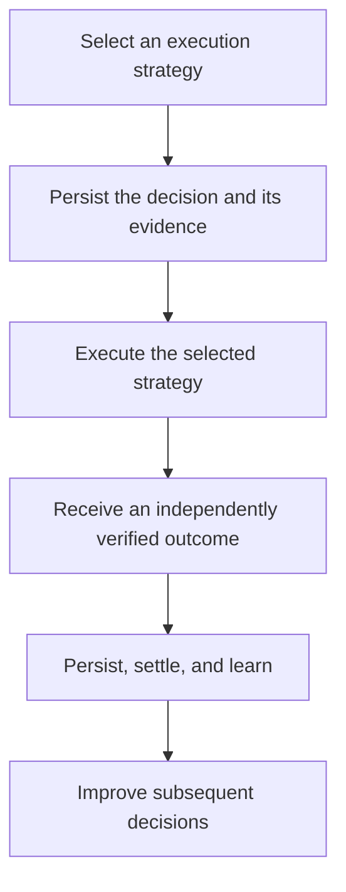

# Thompson

[](https://www.rust-lang.org/)
[](https://go.dev/)
[](protocol/SPEC.md)
[](LICENSE-MIT)

**Adaptive execution decisions backed by verifiable outcomes.**

Thompson is an open-source adaptive selection engine for applications that repeatedly choose between models, providers, or execution strategies. It uses Thompson Sampling to learn from observed outcomes and improve future decisions.

The problem is not choosing the cheapest model for one request. It is learning which available strategy reliably completes a job while preserving the evidence needed to evaluate that decision.

A successful HTTP response is not proof of task success.

## Why Thompson?

Applications often rely on fixed rules to choose between interchangeable execution strategies. Those rules can become outdated as provider reliability, model performance, workloads, and costs change.

Thompson provides a decision and learning mechanism that can adapt when outcomes are measurable.

Examples include:

- Choosing between approved AI models for recurring tasks.
- Comparing execution strategies with different fallback behavior.
- Adapting provider selection as verified success rates change.
- Recording selection evidence for offline policy evaluation.

Thompson is not a replacement for your application, your validators, or your existing inference infrastructure. Your application remains responsible for execution and determining whether the resulting work was correct.

## How it works



A decision records the selected arm, eligible alternatives, policy identity, and the policy state used for selection.

An outcome describes the result of the job rather than merely the transport response. Outcomes can arrive late, remain unknown, or be corrected after further verification.

Thompson preserves the event history needed to recover its learned state without counting duplicate or superseded outcomes twice.

## What is implemented

The repository includes:

- A Rust Thompson Sampling policy library and deterministic simulator.
- A Go policy implementation and HTTP gateway.
- Atomic decision snapshots that keep selection evidence consistent under concurrent updates.
- Durable decision records and versioned outcome storage.
- A correction-safe learner with deterministic replay and checkpoint recovery.
- A verified-outcome gateway mode with authenticated settlement support at the library level.
- Shadow execution, evidence analysis, propensity validation, and offline policy evaluation.
- A Rust snapshot control plane.

The existing gateway also supports a legacy mode that learns from transport-derived observations.

Verified-outcome mode separates provider execution from authoritative job settlement. It does not treat an HTTP 200 response as verified task acceptance or a timeout as verified task rejection.

## Current limitations

Thompson is an engineering-stage system, not a production-ready distributed routing service.

The checked-in Go router executable still requires integration of the verified settlement endpoint into its production route configuration. The underlying handler and learner exist, but the full verified-outcome workflow must not be advertised as operational through the shipped binary until that integration is complete.

The current verified learner uses accepted/rejected outcomes. It is **not cost-aware**: cost, retries, validation and human review must be measured separately until a cost-sensitive objective is explicitly designed and tested.

Verified mode currently requires a single writer, durable local storage, and an exact Thompson policy configuration. Multi-replica coordination is not implemented.

The settlement system records caller-supplied outcome provenance; it does not independently establish that a customer's validator or human reviewer is trustworthy.

No production savings are claimed.

## Quick start

### Requirements

- Rust 1.75 or later.
- Go 1.22 or later.
- Docker and Helm only if building container images or rendering deployment charts.

Run the existing tests:

```sh
cargo test --workspace
cd go && go test -race ./...
```

The `-race` check matters because the Go policy and gateway serve concurrent HTTP handlers.

### Rust policy

The Rust library can be embedded directly into an application. The caller selects an arm, executes the corresponding work, and reports the observed outcome. Add `thompson-sampling` plus `rand` with the `small_rng` feature to your dependencies, then:

```rust
use rand::{rngs::SmallRng, SeedableRng};
use thompson_sampling::{Outcome, ThompsonSampling};

fn main() {
    let mut rng = SmallRng::seed_from_u64(42);

    let mut policy = ThompsonSampling::with_defaults([
        "model-a",
        "model-b",
    ]);

    let selected = policy
        .select(&mut rng)
        .expect("policy has eligible arms");

    // Execute the selected strategy and obtain a real result.
    let outcome = Outcome::new(320.0, true, 0.0012)
        .with_quality(0.87);

    policy
        .record_outcome(&mut rng, &selected, &outcome)
        .expect("selected arm is registered");
}
```

This demonstrates the policy library, not the Go gateway's durable verified-outcome contract. Applications must define trustworthy outcome signals appropriate to their workload.

### Go gateway

For local development:

```sh
cd go
EVIDENCE_PATH=./evidence.jsonl go run ./router
```

Without configured provider URLs, the gateway uses its fake providers for local verification. Fake-provider results are not evidence of model quality or production performance. Verify it is up and routing:

```sh
curl http://localhost:8080/health
curl -X POST http://localhost:8080/v1/chat/completions -d '{"model":"local-check"}'
```

The executable's default mode remains legacy transport-based learning. Consult the verified-mode operational documentation before integrating the separate durable settlement path.

Do not expose the development gateway to untrusted clients.

## Evidence and evaluation

Thompson records decision evidence for reproducibility and offline policy evaluation.

The existing tools support evidence analysis, IPS/SNIPS evaluation, and propensity validation:

```sh
cd go
go run ./cmd/analyze --evidence ./evidence.jsonl
go run ./cmd/evaluate --evidence ./evidence.jsonl --policy uniform-v1 --propensity reference
go run ./cmd/propensity-audit --evidence ./evidence.jsonl
```

Offline comparisons require adequate overlap and sufficiently accurate action probabilities. The evaluation tools explicitly distinguish unsupported or statistically unreliable comparisons.

See:

- [Propensity validation](docs/PROPENSITY_VALIDATION.md)
- [Simulation findings](docs/FINDINGS.md)
- [Verified-mode operations](docs/engineering/PR3A_OPERATIONS.md)
- [Experiment specification](docs/engineering/PR3B_EXPERIMENT_SPEC.md)

## Next milestone

The immediate engineering objective is a randomized experiment comparing:

1. An application's existing fixed execution policy.
2. A quality-qualified static strategy.
3. Thompson's adaptive policy.

The intended business metric is fully loaded cost per verified successful job at an agreed quality threshold, accounting for retries, validation, human review, and unresolved outcomes where measurable.

The current learner optimizes accepted/rejected outcomes, not cost directly. The experiment must establish whether the implemented system offers an economic improvement; that improvement is not assumed.

## Repository

- `crates/thompson-sampling` — Rust policy library
- `crates/thompson-sim` — Deterministic simulation
- `crates/control-plane` — Rust snapshot control plane
- `go/thompson` — Go policy and decision snapshots
- `go/gateway` — HTTP routing, durable decisions, verified settlement, and evidence
- `go/outcome` — Versioned outcomes, durable learning, and recovery
- `go/cmd` — Evidence analysis and evaluation utilities
- `protocol` — Rust/Go snapshot interoperability
- `docs` — Research findings, design contracts, operational documentation, and experiment specifications
- `helm` — Experimental deployment charts

## License

Dual-licensed under [MIT](LICENSE-MIT) or [Apache-2.0](LICENSE-APACHE), at your option.
